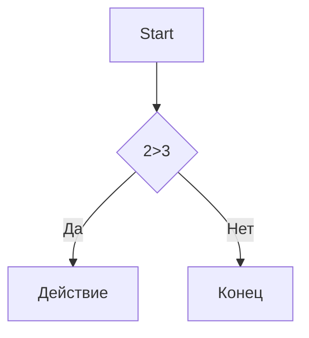

# Hw_22.09

# Markdown

## 1.Что такое Markdown?
Markdown — это облегчённый язык разметки, созданный с целью обозначения форматирования в простом тексте, с максимальным сохранением его читаемости человеком, и пригодный для машинного преобразования в языки для продвинутых публикаций (HTML, Rich Text и других).

## 2.История Markdown
В 2004 году Джон Грубер придумал Markdown, чтобы писать тексты, которые легко читать в исходнике и легко конвертировать в HTML. Сегодня это стандарт де-факто для README на GitHub.

## 3.Примеры использования Markdown
### 1.Форматирование текста

- Выделение текста
----------------

- *Курсив*  / _Курсив_

- **Жирный** / __Жирный__

- ***Жирный курсив*** / ___Жирный курсив___

- ~~зачеркнутый~~

- `моноширинный код`

### 2.Списки

- Пункт 1
- Пункт 2
  - Вложенный
  - Вложенный 
* Пункт 3
+ Пункт 4

1. Первый
2. Второй
3. Третий
   1. Вложенный
   2. Вложенный

- [ ] 1
- [x] 2
- [x] 3

### 3.Ссылки

[текст ссылки](https://youtube.com)

[С подсказкой](https://youtube.com "ютуб(при наведении)")

<https://auto-link.com>

[Ссылочный стиль][1]

[1]: https://youtube.com

### 4.Картинки

 


[](https://avatarko.ru/img/kartinka/1/Crazy_Frog.jpg)

### 5.Цитаты

>Цитата
>Так можно писать не одну строку
> > Вложенная цитата

### 6.Написание кода

```Markdown
print("Hi") Python
```

```Python
c = a+b
print(f"{c} = {a} + {b}")
```

### 7.Таблицы

---: ориентация справа
 
 :---: ориентация по центру
 
 :--- ориентация слева
 
| Имя | Возраст | Город |
|-----:|:---:|:-----|
|Таня  |12  |   N   |
|Саша  |34  | N     |
|Милана|26  |   N   |
|Катя  | 78 |   N   |
|Женя  | 68 |  N    |
|Маша  |15  |   N   |

### 8.Диаграмма



### 9.Экранирование
\# вот так вот

\[и вот так\]

### 9.Сcылка на заголовок

- [Заголовок в начале статьи](#2-markdown)
